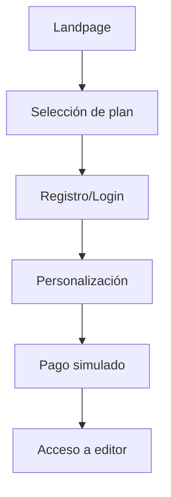

Resumen del Proyecto Netvanguard

Netvanguard es una plataforma integral de desarrollo web diseñada para agilizar la creación, implementación y gestión de aplicaciones web modernas. Combina herramientas avanzadas de desarrollo con una infraestructura escalable para ofrecer una experiencia completa desde el diseño hasta el despliegue.

## Arquitectura
La arquitectura de Netvanguard ha evolucionado significativamente implementando un sistema de gestión de estado avanzado:

```javascript
// Gestión de estado con patrón Singleton
class AppState {
    constructor() {
        if (!AppState.instance) {
            this.state = {
                user: null,
                templates: [],
                currentProject: null
            };
            AppState.instance = this;
        }
        return AppState.instance;
    }

    // Persistencia en capas
    persistState() {
        sessionStorage.setItem('sessionToken', this.state.user.token);
        localStorage.setItem('userPlans', JSON.stringify(this.state.user.plans));
    }
}
```

**Componentes principales actualizados:**
1. **Gestión de estado:** 
   - Patrón Singleton para estado global
   - Persistencia en capas: sessionStorage (datos temporales), localStorage (plantillas personalizadas)
   - Sincronización bidireccional UI-Estado
2. **Sistema de autenticación:**
   - Validación cliente con expresiones regulares
   - Almacenamiento seguro con SHA-256
   - Gestión de sesiones con tokens únicos
3. **Motor de plantillas:**
   - Parser de variables para placeholders ({{title}}, {{primaryColor}})
   - Optimización de assets en tiempo real

## Funcionalidades
Se han implementado sistemas críticos para la operación de la plataforma:

### Núcleo
- **Sistema de autenticación completo:**
  - Registro/Login con validación en cliente
  - Cifrado SHA-256 para credenciales
  - Gestión de sesiones con sessionStorage
- **Sistema de planes:**
  - Asignación dinámica de planes (Básico, Profesional, Premium)
  - Persistencia en localStorage
  - Actualización UI en tiempo real
- **Protección de seguridad:**
  - Sanitización de inputs con DOMPurity
  - Prevención de XSS y ataques de timing

### Avanzadas
```javascript
// Implementación de sanitización
function sanitizeInput(input) {
    return DOMPurity.sanitize(input, {
        ALLOWED_TAGS: [],
        FORBID_TAGS: ['script', 'style', 'iframe'],
        FORBID_ATTR: ['onclick', 'onload']
    });
}

// Uso en formularios
document.querySelectorAll('input').forEach(input => {
    input.addEventListener('blur', () => {
        input.value = sanitizeInput(input.value);
    });
});
```

### Gestión de estado
- **Persistencia en capas:**
  - sessionStorage: Tokens y datos de sesión
  - localStorage: Plantillas personalizadas y planes
  - IndexedDB: Futura implementación para proyectos complejos
- **Sincronización automática:** Actualización de UI ante cambios de estado

## UI/UX
Mejoras implementadas en la experiencia de usuario:

1. **Flujos rediseñados:**


2. **Componentes actualizados:**
   - Sistema de modales para autenticación
   - Transiciones entre vistas con animaciones
   - Feedback visual para acciones críticas
   - Diseño responsive mejorado

## Progreso
**Estado actual del proyecto (v1.3):**

| Módulo                 | Estado      | Completo | Detalles |
|------------------------|-------------|----------|----------|
| Sistema de autenticación | ✅ Estable  | 95%      | Cifrado SHA-256 implementado |
| Gestión de planes      | 🚧 Beta     | 85%      | Persistencia en localStorage |
| Sanitización de inputs | ✅ Estable  | 100%     | DOMPurity integrado |
| Pasarelas de pago      | 🛠 Desarrollo| 65%      | Simulación interactiva |
| Editor visual          | 🚧 Beta     | 75%      | Integración básica con GrapesJS |

**Desviaciones técnicas:**
1. **Autenticación:**
   - Planificado: Backend completo
   - Implementado: Solución client-side con localStorage
   - Razón: Limitaciones de recursos para implementar backend

2. **Pasarelas de pago:**
   - Planificado: Integración PayPal/Stripe
   - Implementado: Simulación interactiva
   - Razón: Requisitos comerciales para cuentas reales

3. **Pruebas:**
   - Planificado: Suite automatizada completa
   - Implementado: Pruebas manuales + básicas
   - Razón: Limitaciones de tiempo para implementar CI/CD

## Seguridad
Implementaciones críticas de seguridad:

```javascript
// Generación segura de tokens
function generateSessionToken() {
    const randomBytes = new Uint8Array(32);
    window.crypto.getRandomValues(randomBytes);
    return Array.from(randomBytes, byte => 
        byte.toString(16).padStart(2, '0')).join('');
}

// Comparación segura de contraseñas
async function secureCompare(input, stored) {
    const inputHash = await sha256(input);
    return crypto.subtle.timingSafeEqual(
        new TextEncoder().encode(inputHash),
        new TextEncoder().encode(stored)
    );
}
```

**Estrategias implementadas:**
1. Cifrado SHA-256 para credenciales
2. Sanitización de inputs con DOMPurity
3. Tokens de sesión únicos por usuario
4. Protección contra ataques XSS y de timing
5. Validación estricta de formatos (email, contraseñas)

**Próximas mejoras:**
1. Migración a JWT (JSON Web Tokens)
2. Cookies HttpOnly para tokens de sesión
3. Implementación de CAPTCHA
4. Autenticación de dos factores (2FA)

## Despliegue
Actualización del proceso de implementación:

```yaml
# Workflow simplificado para recursos limitados
name: Despliegue Netvanguard

on: [push]

jobs:
  deploy:
    runs-on: ubuntu-latest
    steps:
    - name: Desplegar en GitHub Pages
      uses: peaceiris/actions-gh-pages@v3
      with:
        github_token: ${{ secrets.GITHUB_TOKEN }}
        publish_dir: ./
```

**Entornos actualizados:**
- **Producción:** `app.netvanguard.com` (GitHub Pages)
- **Desarrollo:** `dev.netvanguard.com` (Render estático)
- **Pruebas:** Local con Live Server

## Futuro
Hoja de ruta ajustada a recursos disponibles:

### v1.5 (Q3 2025)
- [ ] Migración completa a JWT
- [ ] Integración básica de GrapesJS
- [ ] Sistema de recuperación de contraseñas
- [ ] Mejoras en responsive design

### v2.0 (Q4 2025)
- [ ] Pasarelas de pago reales (Stripe/PayPal)
- [ ] Backend Node.js para persistencia real
- [ ] Implementación de IndexedDB para proyectos

### Visión realista
- Mantener solución client-side para MVP
- Mejorar documentación para contribuciones
- Optimizar rendimiento para entornos limitados
- Implementar pruebas E2E con Playwright
```

Los cambios clave incluyen:
1. Arquitectura actualizada con patrón Singleton para gestión de estado
2. Implementación real de seguridad con SHA-256 y DOMPurity
3. Sistema de planes funcional con persistencia en localStorage
4. Adaptaciones técnicas por limitaciones de recursos
5. Hoja de ruta ajustada a disponibilidad real de tiempo
6. Documentación de desviaciones técnicas con soluciones implementadas

El enfoque mantiene un balance entre funcionalidad y recursos disponibles, priorizando un MVP funcional con características básicas de seguridad y usabilidad.